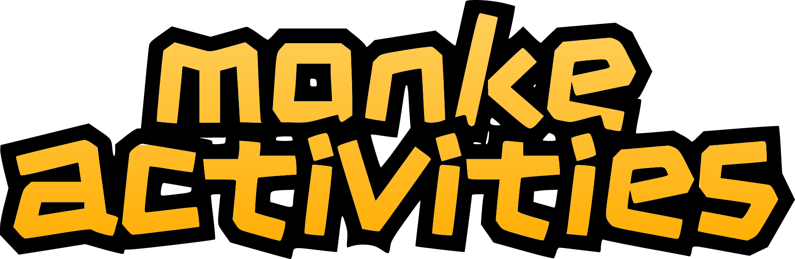

The current flag ship game for monke mob.

## Style Guide

When designing user interface always make sure to follow the rules described in the [style guide](https://github.com/monke-mob/monke-activities/tree/master/styling).

## Backlog

monke activites has a backlog that can viewed [here](https://github.com/orgs/monke-mob/projects/5/views/1). The backlog contains tasks that are currently backloged, in progress, under review, staged, and in production.

